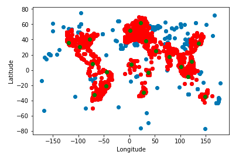
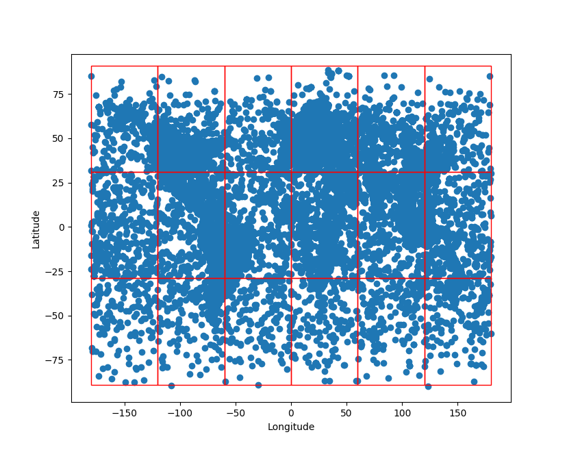
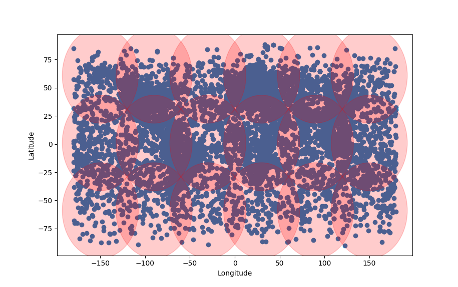
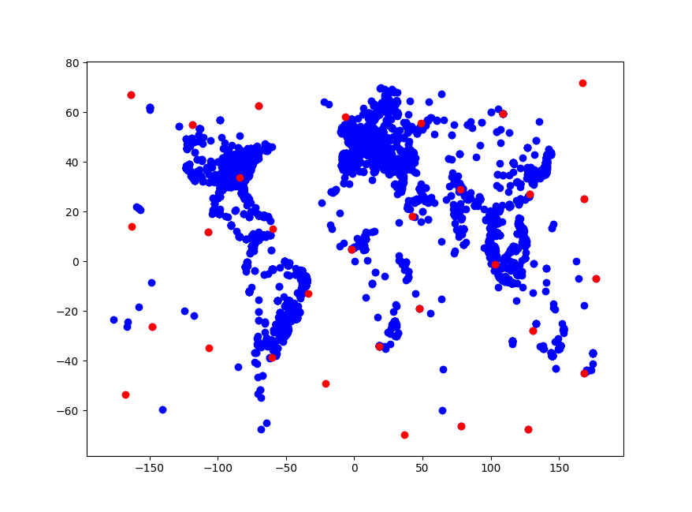

# Streaming Algorithms for k-center Clustering with Outliers

Given n points and distances between every pair of points, the k-center problem consists in choosing k points to place centers such that the maximum distance of a point to a center is minimized. We present in this report the implementation of two algorithms for this problem. Both algorithms are α approximmation-algorithm, meaning the objective function at the end of these algorithms is at most α times the optimal objective function.

The aim in the following is to assign all points (expcept 10 outliers) to one of the 20 centers. The data used to test the algorithms is a set of geolocalisations of tweets.

Here is the result on a subset of these tweets with a static algorithm (i.e an algorithm which needs to put all the points in memory to compute the distances). In red are the covered points, in green are the centers and in blue the points which are not covered.

We can also compute the enclosing rectangle containing all the points and separate the enclosing rectangle into a set of squares.

Then for each square, we can compute the circle containing the square by fixing the center of the circle at the center of the square and its radius as sqrt(2)*length_square.

Moreover, we can compute a lower bound on the minimal radius by computing the minimum radius over a set of the k+z+1 furthest points.

